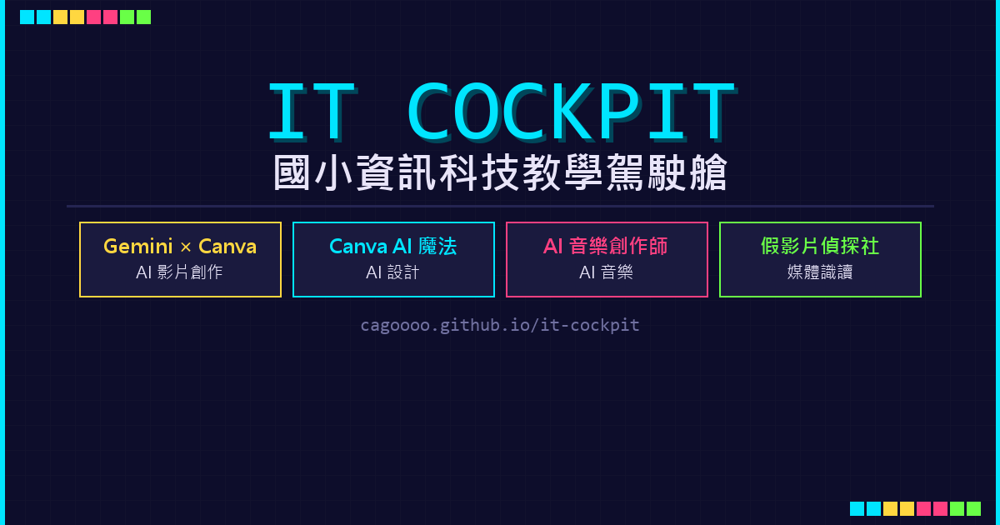

# IT Cockpit｜國小資訊科技教學駕駛艙

[](https://github.com/cagoooo/it-cockpit/actions/workflows/deploy.yml)
[](https://github.com/cagoooo/it-cockpit/actions/workflows/gifted-lab-health.yml)
[](https://cagoooo.github.io/it-cockpit/)



IT Cockpit 是一套為國小資訊科技課程設計的互動式教學入口。它將三至六年級、創造能力資賦優異課程與教師研習教材，整理成可直接投影、操作、練習與複習的獨立教學艙。

本專案目前整理 **39 個課程入口**，其中 38 個教學艙已上線，Tinkercad 3D 列印課程仍在規劃中。內容從電腦操作、網路搜尋、影像設計、Scratch、micro:bit，到 AI 素養、媒體識讀、生成式 AI 創作與專題實作。

## 快速入口

| 入口 | 用途 |
|---|---|
| [開啟 IT Cockpit](https://cagoooo.github.io/it-cockpit/) | 依年級與主題選擇全部教學艙 |
| [資優班專區](https://cagoooo.github.io/it-cockpit/gifted-ai-lab/) | 黃凱揚老師 10 次雙節、共 20 節的 AI 創意解題課程 |
| [資優班教材連結庫](https://cagoooo.github.io/it-cockpit/gifted-ai-lab/resource-library.html) | 依週次、使用對象與關鍵字篩選網站、影片、簡報及學習單 |
| [iPad 課前檢查](https://cagoooo.github.io/it-cockpit/gifted-ai-lab/preflight.html) | 檢查版本、快取、容量、圖片、影片與外部服務 |
| [逐字稿搜尋](https://cagoooo.github.io/it-cockpit/gifted-ai-lab/transcripts.html) | 搜尋資優班影片內容並快速跳到對應段落 |
| [教材來源與授權](https://cagoooo.github.io/it-cockpit/gifted-ai-lab/source-credits.html) | 查看 Day of AI 等教材來源、改編範圍與使用方式 |

## 使用對象

- **學生**：按照任務、互動活動與形成性評量逐步學習。
- **教師**：使用投影簡報、教學流程、教材連結與離線備援直接上課。
- **家長**：了解課程目標、學生作品與數位素養學習內容。
- **教師社群**：參考課程分層、互動教材設計及 AI 融入教學方式。

## 教學地圖

### 創造能力資賦優異課程

- [石門智繪客：AI 創意解題](https://cagoooo.github.io/it-cockpit/gifted-ai-lab/)
- 正式週次：第 3、6、9、12、15、18、21、24、27、30 週。
- 每次連上兩節課，每節 45 分鐘，共 10 次、20 節。
- 主題包含 AI 判讀、資料與偏見、演算法、Scratch、提示工程、AI 倫理、原型測試與成果發表。
- 每週具有專屬駕駛艙、NotebookLM、教師詳案、學生任務、投影簡報、影片與逐字稿。

### 三年級｜資訊基礎

[電腦新朋友](https://cagoooo.github.io/it-cockpit/computer-friend/) ·
[Windows 基礎](https://cagoooo.github.io/it-cockpit/windows-basics/) ·
[英文打字](https://cagoooo.github.io/it-cockpit/typing-en/) ·
[PaGamO 世界冒險](https://cagoooo.github.io/it-cockpit/pagamo-world/) ·
[網路搜尋](https://cagoooo.github.io/it-cockpit/internet-search/) ·
[AI 探索家](https://cagoooo.github.io/it-cockpit/ai-explorer/)

### 四年級｜數位創作與機器學習

[Canva 魔法簡報](https://cagoooo.github.io/it-cockpit/canva-magic/) ·
[PhotoCap 影像編輯](https://cagoooo.github.io/it-cockpit/photocap/) ·
[PaGamO 進階](https://cagoooo.github.io/it-cockpit/pagamo-advanced/) ·
[端午 AI 音樂](https://cagoooo.github.io/it-cockpit/dragonboat-ai-music/) ·
[Google Workspace](https://cagoooo.github.io/it-cockpit/google-workspace-basics/) ·
[機器學習入門](https://cagoooo.github.io/it-cockpit/machine-learning/)

### 五年級｜程式設計與創客

[數位安全](https://cagoooo.github.io/it-cockpit/digital-safety/) ·
[資安特攻隊](https://cagoooo.github.io/it-cockpit/security-squad/) ·
[Scratch 動畫](https://cagoooo.github.io/it-cockpit/scratch-animation/) ·
[Scratch 遊戲](https://cagoooo.github.io/it-cockpit/scratch-game/) ·
[Inkscape 向量繪圖](https://cagoooo.github.io/it-cockpit/inkscape-vector-art/) ·
[micro:bit MakeCode](https://cagoooo.github.io/it-cockpit/microbit-makecode/) ·
Tinkercad 3D 列印（規劃中） ·
[演算法挑戰](https://cagoooo.github.io/it-cockpit/algorithm/)

### 六年級｜AI 創作、媒體識讀與專題

[Gemini × Canva 影片](https://cagoooo.github.io/it-cockpit/gemini-canva/) ·
[Canva AI](https://cagoooo.github.io/it-cockpit/canva-ai/) ·
[AI 音樂](https://cagoooo.github.io/it-cockpit/gemini-music/) ·
[AI 中文生圖 PK](https://cagoooo.github.io/it-cockpit/ai-image-pk/) ·
[故事生圖 Gem](https://cagoooo.github.io/it-cockpit/gem-storymaker/) ·
[Deepfake 偵探](https://cagoooo.github.io/it-cockpit/deepfake-detective/) ·
[事實查核](https://cagoooo.github.io/it-cockpit/fact-check/) ·
[Gemini 引導式學習](https://cagoooo.github.io/it-cockpit/gemini-guided-learning/) ·
[AI 訓練師](https://cagoooo.github.io/it-cockpit/ai-trainer/) ·
[AR／VR 穿戴科技](https://cagoooo.github.io/it-cockpit/ar-vr-wearables/) ·
[麥昆小車](https://cagoooo.github.io/it-cockpit/mqueen-microbit/) ·
[Blogger × AI](https://cagoooo.github.io/it-cockpit/blogger-ai-design/) ·
[Suno 班級神曲](https://cagoooo.github.io/it-cockpit/suno-class-song/) ·
[畢業紀念影片](https://cagoooo.github.io/it-cockpit/grad-film-ai/) ·
[痞客邦部落格](https://cagoooo.github.io/it-cockpit/pixnet-blog/) ·
[AI 公平性與偏誤](https://cagoooo.github.io/it-cockpit/ai-fairness/)

### 教師研習

[A2 PaGamO 遊戲化教學](https://cagoooo.github.io/it-cockpit/pagamo-gamified-learning/) ·
[AI 素養教學引導](https://cagoooo.github.io/it-cockpit/teaching/)

## 教學艙分層

各教學艙會依主題需要組合下列內容，不以單純閱讀網頁為目標：

1. **課程入口**：用年級、主題與學習目標快速選課。
2. **概念理解**：以中小學生能理解的短句、圖像與生活情境說明。
3. **互動任務**：透過模擬器、分類、拖曳、選擇或創作活動實際操作。
4. **投影簡報**：支援全螢幕、鍵盤或觸控切換，方便課堂共學。
5. **形成性評量**：用題目、提示、重試與學習證據確認是否理解。
6. **延伸資源**：依需要串接 NotebookLM、YouTube、Google Drive 與外部教學網站。

## 資優班數位整合

資優班專區是本 repo 目前最完整的課程整合範例，採「年度總覽＋逐週獨立教材」架構：

- 十個固定週次各自有獨立網址，不會全部塞在單一頁面。
- 教師詳案、學生任務、NotebookLM、簡報、影片及逐字稿均依週次對應。
- 提供教師備忘、跨裝置同步、理解觀察、量規、報告及隱私安全檢核。
- 提供 iPad 課前檢查、PWA 快取、離線入口與課堂備援。
- Day of AI 本土化教材已依學生與教師用途分流，並保留來源與授權說明。

詳細開發紀錄請參考 [`gifted-ai-lab/ROADMAP.md`](gifted-ai-lab/ROADMAP.md)。

## 技術架構

- 純 HTML、CSS 與 JavaScript，多數教學艙不需要後端即可使用。
- GitHub Pages 提供正式靜態網站與 HTTPS。
- Service Worker 與 PWA 快取支援部分教材離線備援。
- Firebase／Firestore 僅用於資優班教師紀錄同步；敏感設定不得寫入 repo。
- GitHub Actions 在 `main` 更新後自動部署，並執行資優班健康與版本檢查。

## 本機預覽

請使用本機 HTTP 伺服器，不建議直接雙擊 HTML，因為 Service Worker、模組或部分瀏覽器權限需要 `http://localhost`。

```powershell
cd C:\path\to\it-cockpit
python -m http.server 8000
```

開啟：<http://localhost:8000/>

## 品質檢查

資優班相關修改在提交前可執行：

```powershell
node gifted-ai-lab/tools/check-gifted-links.mjs
node gifted-ai-lab/tools/check-course-versions.mjs
node gifted-ai-lab/tools/smoke-phase-six.mjs
node gifted-ai-lab/tools/check-day-of-ai-resources.mjs
```

檢查範圍包含內部連結、離線資產、公開影片、教材版本、iPad 顯示、互動元件及外部教材入口。

## 部署方式

推送到 `main` 後，[Deploy to GitHub Pages](https://github.com/cagoooo/it-cockpit/actions/workflows/deploy.yml) 會自動部署整個 repo。資優班檔案變更時，[Gifted Lab Health Check](https://github.com/cagoooo/it-cockpit/actions/workflows/gifted-lab-health.yml) 會額外執行教材一致性與瀏覽器冒煙測試。

## 教材來源與使用

本 repo 包含自製內容、改編教材及外部服務入口。各項教材的著作權與使用條件可能不同，引用或再利用前請查看個別來源說明；Day of AI 相關改編請先閱讀[教材來源與授權頁](https://cagoooo.github.io/it-cockpit/gifted-ai-lab/source-credits.html)。本 repo 目前未宣告一體適用的開源授權。

## 作者與學校

- 教學設計與製作：[黃凱揚老師／阿凱老師](https://www.smes.tyc.edu.tw/modules/tadnews/page.php?ncsn=11&nsn=16#a5)
- 任教學校：桃園市龍潭區石門國民小學
- GitHub：[cagoooo](https://github.com/cagoooo)

---

Made with ❤️ by [阿凱老師](https://www.smes.tyc.edu.tw/modules/tadnews/page.php?ncsn=11&nsn=16#a5)

---

<!-- BEGIN:PROJECT_GUIDE -->
## 專案導覽

國小資訊科技教學駕駛艙

- 專案定位：教育科技／教學支援專案
- Repository：`cagoooo/it-cockpit`
- 可見性：公開
- 主要技術：HTML
- 線上入口：未在 GitHub repository metadata 設定

### 可以怎麼應用

- 教師備課、課堂示範與學生自主練習
- 依年級、領域或校本課程替換內容，建立可重複使用的教學版本
- 作為教育科技活動、學習成效觀察或 AI 輔助教學的原型

這些是依目前專案定位整理的延伸方向，不代表所有情境都已內建完成；實作前請先確認現有功能與資料格式。

### 技術與專案結構

- `README.md`
- `apple-touch-icon.png`
- `index.html`

檔案結構會隨版本演進；若本節與程式碼不一致，以目前預設分支的原始碼為準。

### 本機執行

這是可直接由瀏覽器載入的靜態網站。可用任一靜態檔案伺服器預覽，例如：
```bash
python -m http.server 8000
```
接著開啟 `http://localhost:8000`。請避免直接以 `file://` 測試需要模組、請求或 Service Worker 的功能。

### 給 AI Agent 的接手指南

1. 先閱讀本 README、`AGENTS.md`（若有）、套件腳本與部署設定。
2. 先辨識教材、題庫、提示詞或設定資料的單一來源，避免只改畫面上的副本。
3. 調整內容時維持適齡、可讀性、無障礙與個資保護。
4. 修改後驗證教師操作流程、學生操作流程，以及桌機、平板、手機的可用性。
5. 不要捏造尚未存在的功能；README 與實作有落差時，應同時更新文件。
6. 提交前只納入本次任務檔案，並記錄實際執行過的驗證。

### 安全與資料注意事項

- 不要提交 `.env`、服務帳號、API 金鑰、token、學生個資或正式環境匯出資料。
- 使用 Firebase、Supabase、Google API 或其他雲端服務時，請建立自己的測試專案並套用最小權限。
- 若要公開衍生作品，請先確認程式碼、圖片、音訊、字型與教材內容的授權。

### 貢獻與客製化

歡迎依教學現場、活動或工作流程需求進行 fork／客製化。建議在變更說明中交代使用情境、主要修改、測試方式，以及是否影響資料格式或部署設定。
<!-- END:PROJECT_GUIDE -->
